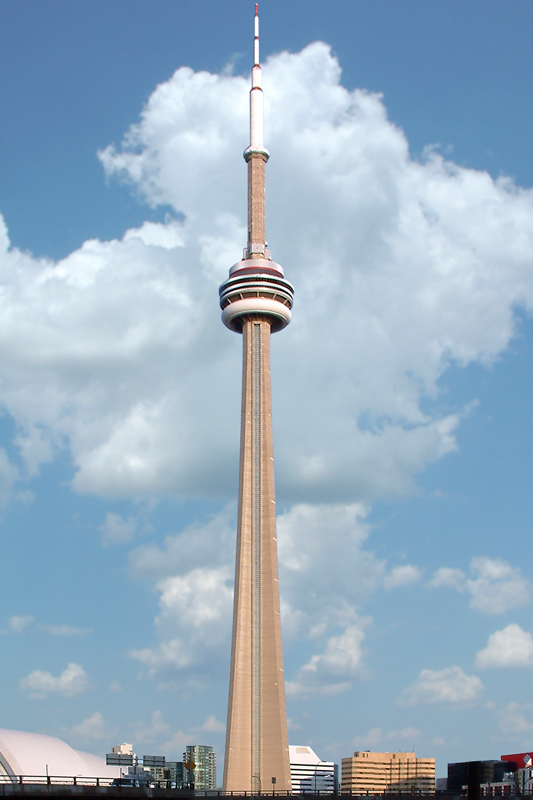

# Landmark Detection Example

This example demonstrates landmark detection using the `vision` CLI on an image of the CN Tower in Toronto, Canada.



## Prerequisites

- Google Cloud service account with the Vision API enabled
- A JSON credentials file for the service account

## Setup

Place your service account credentials file at the default path:

```sh
mkdir -p ~/.vision
cp /path/to/your/credentials.json ~/.vision/credentials.json
```

Or pass a custom path with `--credential-file`.

## Run Landmark Detection

Detect landmarks in the image:

```sh
dart run vision detect --image-file example/cn_tower.jpg --features LANDMARK_DETECTION
```

### Expected Output

A successful response returns an entity annotation with the landmark name, confidence score, and bounding polygon:

```json
{
  "mid": "/m/0c6m",
  "description": "CN Tower",
  "score": 0.987,
  "boundingPoly": {
    "vertices": [
      { "x": 120, "y": 80 },
      { "x": 500, "y": 80 },
      { "x": 500, "y": 720 },
      { "x": 120, "y": 720 }
    ]
  }
}
```

## Additional Detection Types

The same image supports other Vision API features. Try them together:

### Label Detection

```sh
dart run vision detect --image-file example/cn_tower.jpg \
  --features LANDMARK_DETECTION,LABEL_DETECTION
```

Returns both the landmark name and general labels (e.g., "skyline", "city", "tower", "landmark").

### Safe Search

```sh
dart run vision detect --image-file example/cn_tower.jpg \
  --features SAFE_SEARCH_DETECTION
```

Returns likelihood ratings for adult, spoof, medical, violence, and racy content.

### Crop Hints

```sh
dart run vision crop_hints --image-file example/cn_tower.jpg
```

Returns suggested crop region vertices for the image.

## Run from the Project Root

From the repository root:

```sh
dart run vision detect --image-file packages/google_vision_cli/example/cn_tower.jpg \
  --features LANDMARK_DETECTION
```
